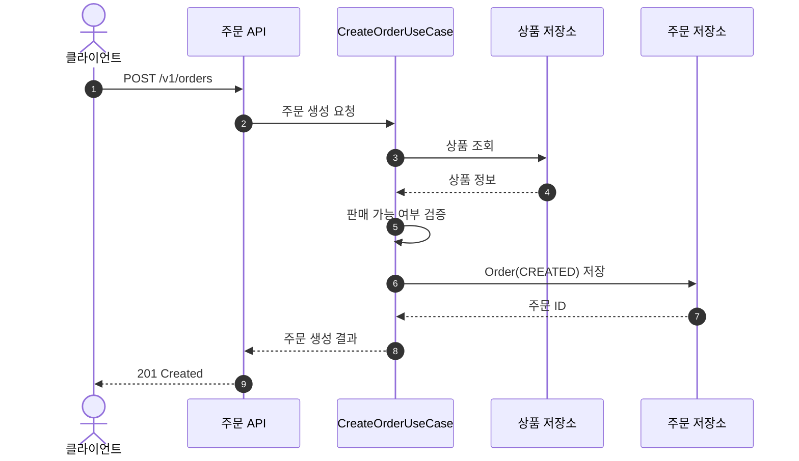
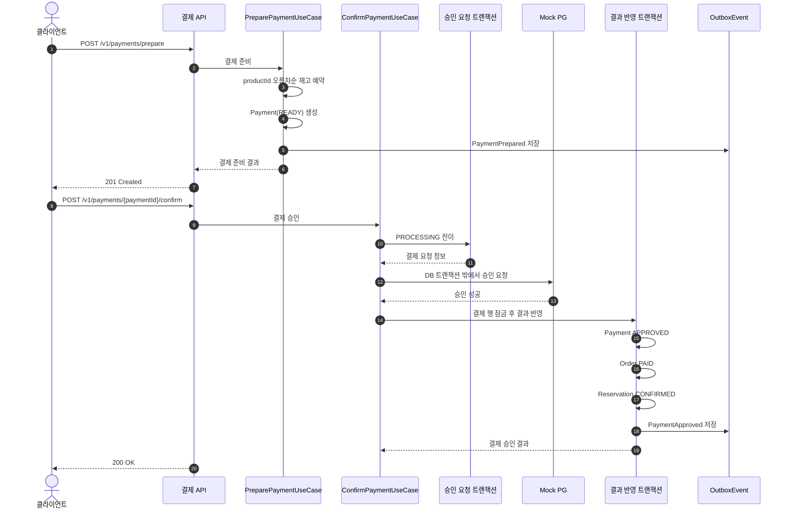
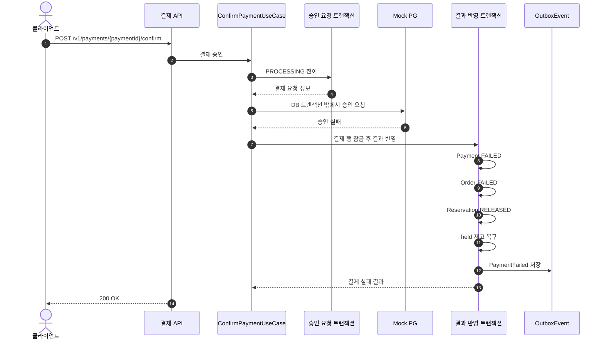
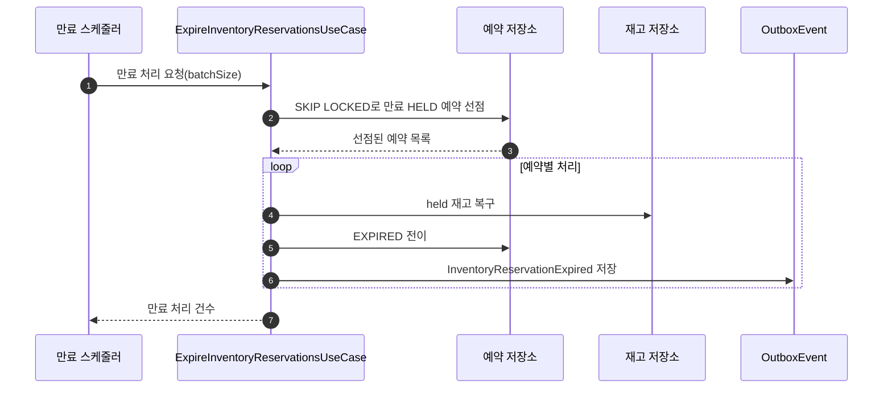
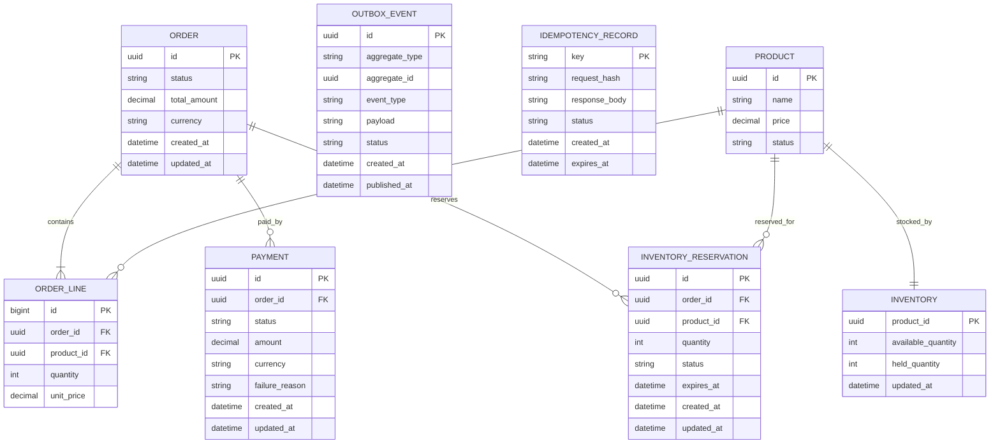
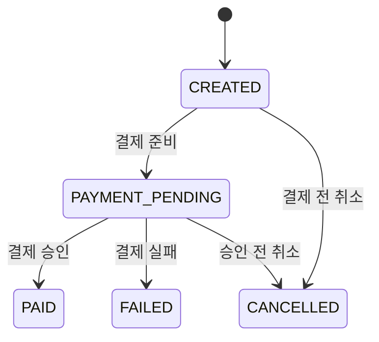
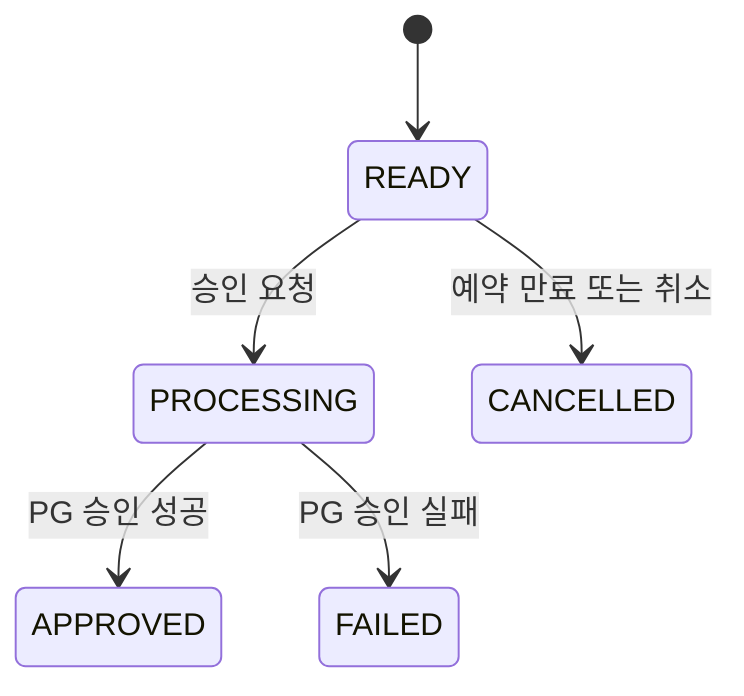
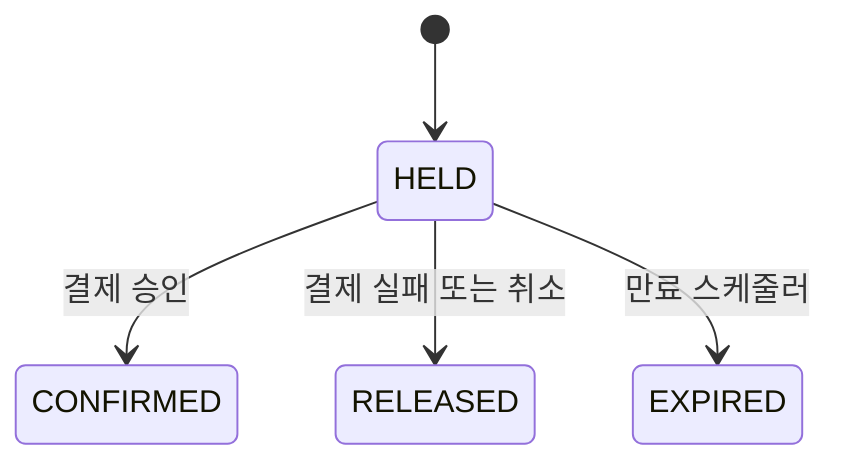

# 아키텍처 다이어그램

이 문서는 현재 구현 기준으로 운영 관점에서 필요한 흐름을 정리한다. 핵심은 트랜잭션 경계, 상태 전이, 비동기 복구 흐름이다.

## 주문 생성

```mermaid
sequenceDiagram
    autonumber
    actor Client as 클라이언트
    participant API as 주문 API
    participant App as CreateOrderUseCase
    participant Product as 상품 저장소
    participant Order as 주문 저장소

    Client->>API: POST /v1/orders
    API->>App: 주문 생성 요청
    App->>Product: 상품 조회
    Product-->>App: 상품 정보
    App->>App: 판매 가능 여부 검증
    App->>Order: Order(CREATED) 저장
    Order-->>App: 주문 ID
    App-->>API: 주문 생성 결과
    API-->>Client: 201 Created
```

## 결제 성공

```mermaid
sequenceDiagram
    autonumber
    actor Client as 클라이언트
    participant API as 결제 API
    participant Prepare as PreparePaymentUseCase
    participant Confirm as ConfirmPaymentUseCase
    participant Tx1 as 승인 요청 트랜잭션
    participant PG as Mock PG
    participant Tx2 as 결과 반영 트랜잭션
    participant Outbox as OutboxEvent

    Client->>API: POST /v1/payments/prepare
    API->>Prepare: 결제 준비
    Prepare->>Prepare: productId 오름차순 재고 예약
    Prepare->>Prepare: Payment(READY) 생성
    Prepare->>Outbox: PaymentPrepared 저장
    Prepare-->>API: 결제 준비 결과
    API-->>Client: 201 Created

    Client->>API: POST /v1/payments/{paymentId}/confirm
    API->>Confirm: 결제 승인
    Confirm->>Tx1: PROCESSING 전이
    Tx1-->>Confirm: 결제 요청 정보
    Confirm->>PG: DB 트랜잭션 밖에서 승인 요청
    PG-->>Confirm: 승인 성공
    Confirm->>Tx2: 결제 행 잠금 후 결과 반영
    Tx2->>Tx2: Payment APPROVED
    Tx2->>Tx2: Order PAID
    Tx2->>Tx2: Reservation CONFIRMED
    Tx2->>Outbox: PaymentApproved 저장
    Tx2-->>Confirm: 결제 승인 결과
    API-->>Client: 200 OK
```

## 결제 실패

```mermaid
sequenceDiagram
    autonumber
    actor Client as 클라이언트
    participant API as 결제 API
    participant Confirm as ConfirmPaymentUseCase
    participant Tx1 as 승인 요청 트랜잭션
    participant PG as Mock PG
    participant Tx2 as 결과 반영 트랜잭션
    participant Outbox as OutboxEvent

    Client->>API: POST /v1/payments/{paymentId}/confirm
    API->>Confirm: 결제 승인
    Confirm->>Tx1: PROCESSING 전이
    Tx1-->>Confirm: 결제 요청 정보
    Confirm->>PG: DB 트랜잭션 밖에서 승인 요청
    PG-->>Confirm: 승인 실패
    Confirm->>Tx2: 결제 행 잠금 후 결과 반영
    Tx2->>Tx2: Payment FAILED
    Tx2->>Tx2: Order FAILED
    Tx2->>Tx2: Reservation RELEASED
    Tx2->>Tx2: held 재고 복구
    Tx2->>Outbox: PaymentFailed 저장
    Tx2-->>Confirm: 결제 실패 결과
    API-->>Client: 200 OK
```

## 예약 만료

```mermaid
sequenceDiagram
    autonumber
    participant Scheduler as 만료 스케줄러
    participant App as ExpireInventoryReservationsUseCase
    participant Repo as 예약 저장소
    participant Inventory as 재고 저장소
    participant Outbox as OutboxEvent

    Scheduler->>App: 만료 처리 요청(batchSize)
    App->>Repo: SKIP LOCKED로 만료 HELD 예약 선점
    Repo-->>App: 선점된 예약 목록
    loop 예약별 처리
        App->>Inventory: held 재고 복구
        App->>Repo: EXPIRED 전이
        App->>Outbox: InventoryReservationExpired 저장
    end
    App-->>Scheduler: 만료 처리 건수
```

## ERD

```mermaid
erDiagram
    ORDER {
        uuid id PK
        string status
        decimal total_amount
        string currency
        datetime created_at
        datetime updated_at
    }

    ORDER_LINE {
        bigint id PK
        uuid order_id FK
        uuid product_id FK
        int quantity
        decimal unit_price
    }

    PAYMENT {
        uuid id PK
        uuid order_id FK
        string status
        decimal amount
        string currency
        string failure_reason
        datetime created_at
        datetime updated_at
    }

    INVENTORY {
        uuid product_id PK
        int available_quantity
        int held_quantity
        datetime updated_at
    }

    INVENTORY_RESERVATION {
        uuid id PK
        uuid order_id FK
        uuid product_id FK
        int quantity
        string status
        datetime expires_at
        datetime created_at
        datetime updated_at
    }

    OUTBOX_EVENT {
        uuid id PK
        string aggregate_type
        uuid aggregate_id
        string event_type
        string payload
        string status
        datetime created_at
        datetime published_at
    }

    IDEMPOTENCY_RECORD {
        string key PK
        string request_hash
        string response_body
        string status
        datetime created_at
        datetime expires_at
    }

    PRODUCT {
        uuid id PK
        string name
        decimal price
        string status
    }

    ORDER ||--|{ ORDER_LINE : contains
    PRODUCT ||--o{ ORDER_LINE : ordered
    ORDER ||--o{ PAYMENT : paid_by
    ORDER ||--o{ INVENTORY_RESERVATION : reserves
    PRODUCT ||--|| INVENTORY : stocked_by
    PRODUCT ||--o{ INVENTORY_RESERVATION : reserved_for
```

## 상태 다이어그램

### 주문

```mermaid
stateDiagram-v2
    [*] --> CREATED
    CREATED --> PAYMENT_PENDING: 결제 준비
    PAYMENT_PENDING --> PAID: 결제 승인
    PAYMENT_PENDING --> FAILED: 결제 실패
    CREATED --> CANCELLED: 결제 전 취소
    PAYMENT_PENDING --> CANCELLED: 승인 전 취소
```

### 결제

```mermaid
stateDiagram-v2
    [*] --> READY
    READY --> PROCESSING: 승인 요청
    PROCESSING --> APPROVED: PG 승인 성공
    PROCESSING --> FAILED: PG 승인 실패
    READY --> CANCELLED: 예약 만료 또는 취소
```

### 재고 예약

```mermaid
stateDiagram-v2
    [*] --> HELD
    HELD --> CONFIRMED: 결제 승인
    HELD --> RELEASED: 결제 실패 또는 취소
    HELD --> EXPIRED: 만료 스케줄러
```
